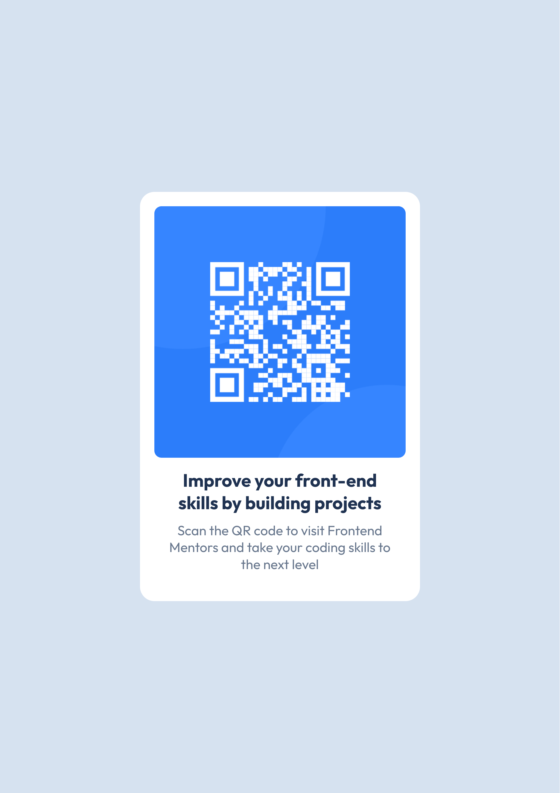

# Frontend Mentor - QR code component solution

This is a solution to the [QR code component challenge on Frontend Mentor](https://www.frontendmentor.io/challenges/qr-code-component-iux_sIO_H). Frontend Mentor challenges help you improve your coding skills by building realistic projects.

## Table of contents

- [Overview](#overview)
  - [Screenshot](#screenshot)
  - [Links](#links)
- [My process](#my-process)
  - [Built with](#built-with)
- [Author](#author)

## Overview

### Screenshot

### Links

- Solution URL: [Github](https://github.com/gopaladhikari/frontend-mentors/tree/main/qr-code-component-main)
- Live Site URL: [Netlify](https://gopuadks-qr-code-component.netlify.app/)

## My process

### Built with

- Semantic HTML5 markup
- CSS custom properties
- Mobile-first workflow with media queries

## Author

- Website - [portfolio](https://www.gopal-adhikari.com.np/)
- Frontend Mentor - [gopaladhikari](https://www.frontendmentor.io/profile/gopaladhikari)
- X - [gopuadks](https://x.com/gopuadks)
